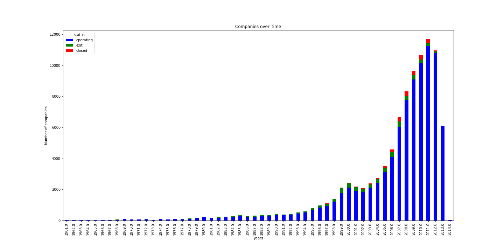

## [Rocket Ship Predictor]() - Cosma Kufa's Capstone Project

### Overview

Rocket Ship is a data science project on start-up rounds of funding meant to help predict whether a start-up will successfully provide an exit for their investors based on crunchbase's 2013 snapshot.   

### Motivation

Investor's in society are the one's who control what direction as a whole society moves in. They are ones who allow a student, like Mark Zuckerberg, to work on creating a social network, meant to connect the world, for years without providing near term profits. However, investing is hard and as can be seen from the crunchbase's dataset only 10% of the rounds of fundraising resulted in a successful exit from a company. Furthermore, we live in unprecedent times. Money has been cheap with interest rates being at all time lows and safer investments having low returns, but this is coming to an end as the Federal Reserve begins to unroll it's balance sheet and increase interest rates. However, as money becomes more expensive, and safer investments start providing higher returns, less money will be allocated to High Risk investments in start-ups that could change society. Thus, in order for start-ups to stay attractive as the times change, their risk profile will need to change as well.

Rocket Ship serves two purposes:

  * Finding successful companies seeking funding
  
  * Limiting Funding in unsuccessful companies
  

### Data

#### Data Source:

Crunchbase 2013 snapshot: [Crunchbase](https://data.crunchbase.com/docs/2013-snapshot) 

#### Data Scope:

The data set used in this project consists of information of Funding Rounds, Funds, Companies, IPO, Acquisitions, and People up to 2013.

### Analysis:
Coming soon

### Instruction:
web app coming soon

### Tools
1.	[Python](https://www.python.org/): the main coding language for this project.
2.	[Amazon RDS](https://aws.amazon.com/rds/): a managed relational database service that provide PostgreSQL. 
3.	[pymsql](https://pymysql.readthedocs.io/en/latest/): a Python library that enables Python code to interact with PostgreSQL database.
4.	[sklearn](http://scikit-learn.org/): Scikit-Learn, a Python library that provides all sorts of machine learning libraries and packages.

### Credits and Acknowledge

Huge Thanks To:

* [crunchbase.com](crunchbase.com) for providing me most of the data
* [Galvanize gSchool ](http://www.galvanize.com/) for equipping me with solid machine learning skills and solidifying my programming skills
* Fellow Students for many many insightful discusssions

